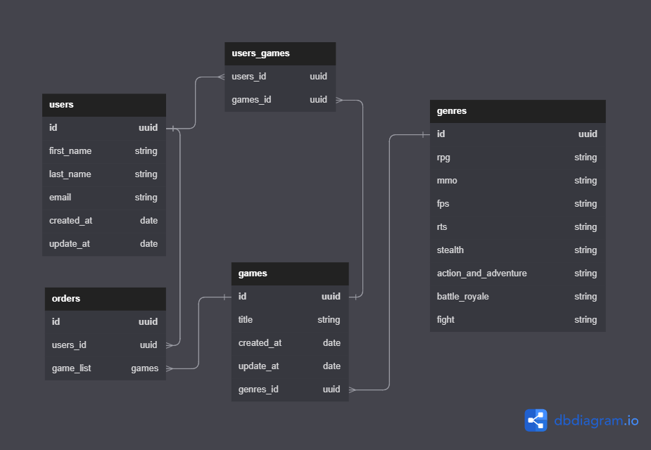

# Desafio - Modelagem do banco de dados

_( Ignite | NodeJS | Capítulo III | Desafio 02 )_

Desafio 02 do capítulo III da trilha NodeJS do bootcamp Ignite, da [Rocketseat](https://app.rocketseat.com.br/).

## O desafio: Modelagem do banco de dados

O objetivo desse desafio é criar a modelagem do banco de dados da aplicação do [Desafio de Queries](https://github.com/valdir-alves3000/ignite-database-queries).

[Instruções](https://www.notion.so/Desafio-02-Modelagem-do-banco-de-dados-0ce9c10f9e114be0a9ee9359d68639ff#d801d72053414c6bb15463e2ed24e3a4)

# Diagrama

